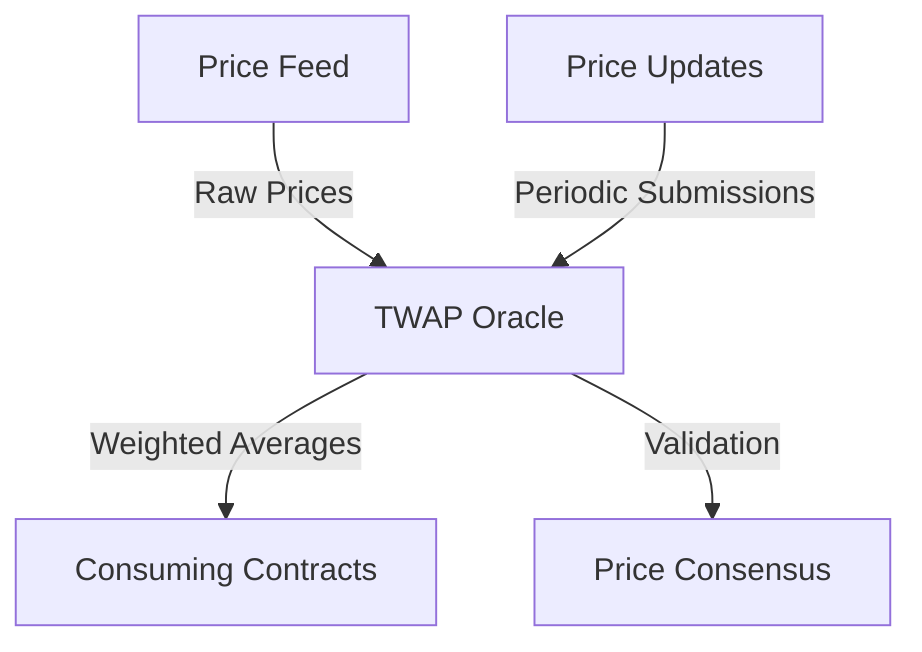

# TWAP Scan: Decentralized Price Oracle

A robust and secure Stacks blockchain smart contract for tracking Time-Weighted Average Price (TWAP) across decentralized exchanges, providing accurate and manipulation-resistant price data.

## Overview

TWAP Scan enables:
- Precise calculation of asset prices over configurable time windows
- Resistance to price manipulation techniques
- Transparent and decentralized price tracking
- Low-cost oracle updates
- Multi-asset support

## Architecture



The system uses specialized data structures to track:
- Historical price points
- Cumulative price data
- Time-weighted calculations
- Update timestamps
- Asset metadata

## Contract Documentation

### Main Contract: twap-oracle

Core functionalities:

1. **Price Tracking**
   - Record price updates
   - Calculate time-weighted averages
   - Manage observation windows
   - Support multiple trading pairs

2. **Oracle Mechanism**
   - Decentralized price submission
   - Consensus-based validation
   - Anti-manipulation safeguards
   - Configurable update intervals

3. **Data Management**
   - Efficient storage of price observations
   - Pruning of historical data
   - Dynamic window sizing
   - Minimal gas/compute costs

## Getting Started

### Prerequisites
- Clarinet development environment
- Stacks wallet
- Basic understanding of TWAP mechanisms

### Basic Usage

**1. Record Price Update**
```clarity
(contract-call? .twap-oracle record-observation 
    "STX-USDC"   ;; trading pair
    u10000       ;; price in micro-units
    u1234        ;; timestamp
)
```

**2. Fetch TWAP**
```clarity
(contract-call? .twap-oracle get-twap 
    "STX-USDC"   ;; trading pair
    u3600        ;; 1-hour window
)
```

## Function Reference

### Oracle Functions
- `record-observation`: Submit new price data
- `get-twap`: Retrieve time-weighted average price
- `set-observation-window`: Configure price window
- `validate-price-submission`: Verify price integrity

## Development

### Testing
Run tests using Clarinet:
```bash
clarinet test
```

### Security Considerations

1. **Price Integrity**
   - Multi-source price verification
   - Outlier detection
   - Submission rate limiting

2. **Data Manipulation Prevention**
   - Weighted average calculations
   - Timestamp validation
   - Consensus mechanisms

3. **Performance Optimization**
   - Efficient data structures
   - Minimal storage requirements
   - Low computational overhead

### Important Limitations
- Price updates require consensus
- Maximum observation window size
- Potential minor calculation variations
- Requires active price feed maintenance